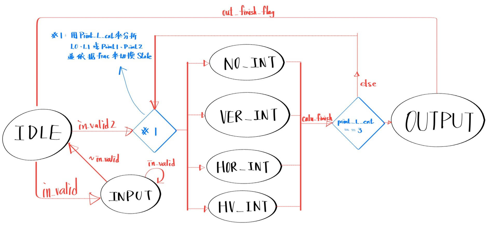
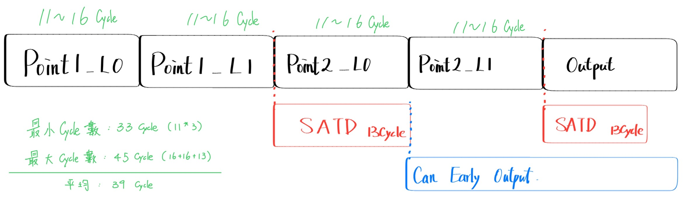
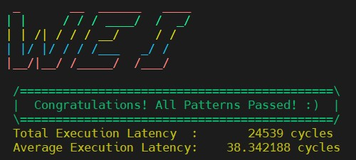
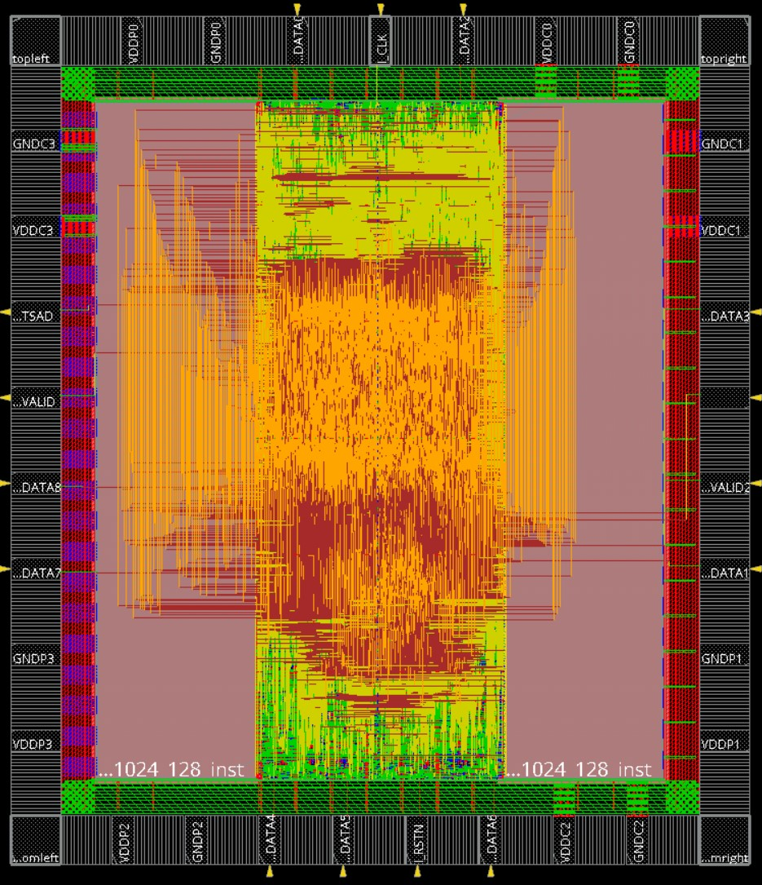

# Final Project：Motion Vector Difference Matching
## 題目說明

- 實現了 H.264 視訊壓縮標準中的 Mirror Motion Vector Difference運算，與Lab5 H.264 Lite呼應。

- 核心架構包含 Fractional Interpolation 與 SATD (Sum of Absolute Transformed Differences) 計算。

### **▲ Inputs**
| 名稱      | 位元數 | 說明                                                                         |
| --------- | ------ | ---------------------------------------------------------------------------- |
| clk       | 1      | 時脈                                                                         |
| rst_n     | 1      | 非同步重置信號                                                               |
| in_valid  | 1      | 圖片有效訊號                                                                 |
| in_valid2 | 1      | 座標有效訊號                                                                 |
| in_data   | 9      | in_valid拉起的時候是載入兩張128X128的圖片，in_valid2拉起的時候是載入兩點座標 |

### **▲Output**
| 名稱      | 位元數 | 說明                                                  |
| --------- | ------ | ----------------------------------------------------- |
| out_valid | 1      | 輸出有效訊號                                          |
| out_value | 1      | 兩個點的計算結果，每個cycle只輸出一個bit，需56cycle。 |

### **▲ 主要流程**

- Input Image :
  將輸入包裝成128bits(16個data)，並把128X128的兩張圖片(L0、L1)存在兩顆SRAM裡面。(細節請參考Tips)
- Input MV :
  當in_valid2拉起時，讀取Point1、Point2的x、y二維座標，LSB為分數部分，剩餘為整數部分。
- Interpolation :
  - 6-tap FIR Filter： 針對Fractional Pixel，用 H.264 標準的 6-tap 濾波器係數 [1, -5, 20, 20, -5, 1] 進行運算。
  - Clipping： 計算後需經過 (Val+16)>>5 或 (Val+512)>>10 的處理，並將數值精準限制在 [0, 255] 之間，防止 Overflow。
  - 並非算出8X8區域，而是算10X10區域，以便後續的SATD計算。(細節請參考Tips)
- SATD :
  - Mirror Matching：範圍為 3x3。當 L0座標 $(+dx, +dy)$ 時，L1座標 則 $(-dx, -dy)$。掃描順序(0,0)->(1,0)->(2,0)->(1,0)...以此類推。
  - Hadamard Transform： 將 8x8 的Residual Block拆解為 4 個 4x4，進行 Hadamard Transform 與絕對值加總。
  - Minimum Search： 比較 9 個搜尋點的 SATD 值，並紀錄最小值及其對應的index(0~8)。
- OUTPUT :
  - Packing：將結果依照格式打包： { P2_Index[3:0], P2_SATD[23:0], P1_Index[3:0], P1_SATD[23:0] }。
  - Valid：拉高 out_valid 56個Cycle，可提前輸出，減少latency(細節請參考Tips)。

<!--  -->

---
## 注意事項
- 期末有兩周，所以可以花多一點時間想好要開多少的SRAM、register、counter以及FSM要怎麼設計，否則就會像我一樣優化一版又一版XD
- 強烈建議先用Python實現演算法，並輸出txt檔，當作pattern使用，不僅可以讓自己更理解題目還可以造福身邊同學[>點這裡<](./Code/output_gen.py)
- 面積雖然是平方，但因為SRAM通常會佔據大部分面積，所以**節省latency最有效果**!!
- 建議把很多內容包成module，之後debug也會方便很多。
- 提早輸出以及提早計算都是非常重要的優化方式。(細節請參考Tips)
- 記得不只05APR的LEF要改，04MEM的LEF也要改，否則繳交上去的會是原版LEF
---
## $Performance$ =  $Chip Area^{2}$ * $Total Latency$ * $Cycle time$ 

| Rank  | demo         | Cycle time | Chip Area   | Total Latency | early finish |
| ----- | ------------ | ---------- | ----------- | ------------- | ------------ |
| **5** | **1st_demo** | 11.1       | 5001011.611 | 24157         | V            |

---
## Design Tips
- **SRAM設計**(第一關鍵優化技術):
  - 第一版設計是用8bits的SRAM存圖片，並分成L0一顆SRAM、L1一顆SRAM，但這樣主要的latency都會浪費在取值，所以我最後使用128bits的SRAM，一次可以取16個pixel
  - 把L0 L1用斑馬紋的形式儲存在SRAM裡面，這樣取值就是每次從兩顆SRAM各取16個pixel出來，然後透過(MVx,MVy)座標來選擇哪些才是真正我要的pixel
  - 若不需要做interpolation的話我**只需要10個Cycle**就可以把10X10的區域都取出來
  - 但若要做interpolation的話就需要**10~15個Cycle**從SRAM取值(因為Interpolation需要算到邊界外的pixel)
  - 在SRAM取值的時候就順便把邊界狀況給考慮進去，這樣後續的interpolation就不需要再花時間去判斷邊界狀況
  - 非常非常建議設計SRAM的時候都稍微畫一下[EXCEL](./Control.xlsx)，讓自己腦袋更加清晰如何設計
      |                            | 8bits SRAM | 128bits SRAM | Matrix Size |
      | -------------------------- | ---------- | ------------ | ----------- |
      | No interpolation           | 100 Cycle  | **10 Cycle** | 10X10       |
      | Horizontal interpolation   | 150 Cycle  | **10 Cycle** | 10X15       |
      | Vertical interpolation     | 150 Cycle  | **15 Cycle** | 15X10       |
      | 2D Separabel interpolation | 225 Cycle  | **15 Cycle** | 15X15       |

- Interpolation
  - 單做Horizontal或者單做Vertical的interpolation，一組面積只有5224(開compile去合成得知)，所以我用面積換取時間，一次開10組，每次當SRAM讀出一行pixel後，就可以同時做10個pixel的interpolation，這樣就可以大幅減少latency
  - 2D的interpolation一樣可以這麼做，只是因為bits數比較大，所以一組面積約9074，但計算完還是省latency最划算
  - Clip的部分我是直接計算出邊界在哪裡，直接做計算，可以少掉有號數的計算及判斷，可些許減少面積。如下：
      ```verilog
      if (Val < 0 ) 
          Clip_Val <= 0 ;
      else if (Val > 8144)
          Clip_Val <= 255 ;
      else
          Clip_Val <= Val[14:5] + Val[4]; // (Val+16) >> 5
      ```
- SATD
  - 因為面積約45072(包含Hadamard)，所以一次開四組，花9個cycle計算各點，均衡時間及面積。
  - 這邊通常會是主要的Critical Path位置，所以我在這邊切了四級的pipeline
    - 1 . 計算 Residual Block (Critical Path : 選擇8X8矩陣的MUX + 64組並行減法器)
    - 2 . 計算整個Hardmard Transform (Critical Path : 64組加減法器)
    - 3 . 計算絕對值相加 (Critical Path :16組MUX + 15組加法器) 
    - 4 . 把四塊4X4加總起來，並比較大小並更新最小值 (Critical Path : 3組加法 + 2組比較器)
  - 但並不會浪費latency，因為SATD的計算是可以跟Interpolation或者Output同時進行的，當我計算完Point1或者Point2的Interpolation後，就可以**同時開始做SATD**的計算(如下圖)。
   
- **提早計算以及提早輸出**(第二關鍵優化技術)：
  - 提早計算：因為Mvx、Mvy的座標需要八個cycle才會收完，但實際上我只需要收到前兩個cycle(Point1_L0)就可以從SRAM取值並做Interpolation，**省6個cycle**
  - 提早輸出：當我第一次SATD做完的時候，我就可以開始先把Point1的結果打包並且拉高out_valid，**省12~16Cycle**
  - 但提早輸出要注意，因為輸出需要連續，所以我如果SATD後直接拉output且point2_L1的模式是2D(16Cycle)，那麼26Cycle後，point2會還沒算完，所以要多加一個判斷在這邊。
  - 如上圖所示，可以看到整個流程中Interpolation、SATD、Output是有重疊的
  - 最終計算結果為平均為**39Cycle**，因為我的pattern前面幾個set是打corner case，所以最後比平均低(如圖)
  <div style="text-align: center;">
    
  </div>


## APR Tips
- 因為我的SRAM是128bits，所以會是比較長方形的設計，但因為不考慮IR drop影響，故Floorplan採用較長形的CHIP形狀(utilization:0.8725 ratio:1.199)
- Floorplan的時候，盡量把SRAM都擺在邊邊。
- 建議自己跑過一次GUI的步驟後，將commend存下來，方便後續優化直接重跑，而不需要手動GUI點。[>點這裡<](./cmd/)
- 我的Design 可以將Cycle Time壓到6.2ns，但最後選擇拿11.1ns去合成，這樣可以讓APR有更多空間，面積也會更小。
- 最後繳交前一定要確定DRC、DRV、LVS、setup、hold time有沒有過，最後可以用summaryReport -noHtml來查看自己APR後的詳細內容(包含面積等等資訊)

---