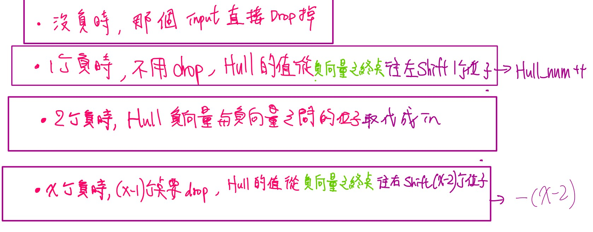
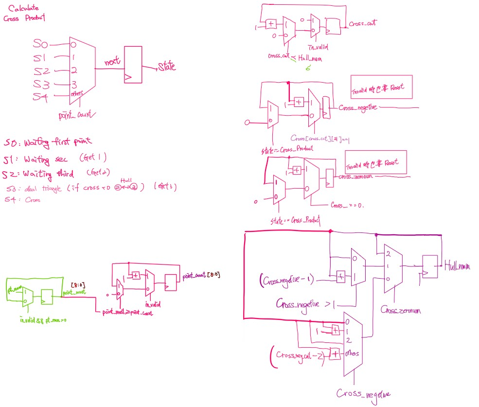

# Lab03 Convex Hull
## 題目說明

### **▲  Inputs**
| 名稱     | 位元數  | 說明                          |
| -------- | ------- | ----------------------------- |
| clk      | 1 bit   | 時脈訊號                      |
| rst_n    | 1 bit   | 非同步Reset                   |
| in_valid | 1 bit   | 輸入有效訊號                  |
| pt_num   | 9 bits  | 該次 pattern 的點數量 (4~500) |
| in_x     | 10 bits | 新點的 X 座標                 |
| in_y     | 10 bits | 新點的 Y 座標                 |

### **▲ Output**
| 名稱      | 位元數  | 說明                     |
| --------- | ------- | ------------------------ |
| out_valid | 1 bit   | 輸出有效訊號             |
| drop_num  | 7 bits  | 加入新點後被丟棄的點數量 |
| out_x     | 10 bits | 需要被丟棄點的 X 座標    |
| out_y     | 10 bits | 需要被丟棄點的 Y 座標    |

### **▲ 主要流程**
1. 輸入點處理
   - 每次收到一個新點座標 (in_x, in_y)
   - 前三個點保證不共線且會形成三角形
   - 從第四個點開始需要判斷是否更新凸包
2. Cross Product計算與分類
   - Cross Product>0  (+)：點在邊的左側（外側）
   - Cross Product<0  (-)：點在邊的右側（內側）
   - Cross Product=0 (0)：點在邊上

3.  Convex Hull 更新
    - 情況 1 : 點在凸包內部
      - 所有邊的Cross Product都是正
      - 直接丟棄新點，drop_num = 1
    - 情況 2 : 點在凸包外部（無共線）
      - 在某一個區間的Cross Product是負
      - 找到Cross Product負號的起點及終點，丟棄中間的點，並加入新點
    - 情況 3 : 一個負、一個零（共線）
      - 共線的外側：替換共線邊的終點
      - 共線的內側：丟棄新點
    - 情況 4 : 一個負、兩個零
      - 負向量的頭尾兩個點都與新點共線
      - 丟掉頭尾，並加入新點
4.  輸出
      - 輸出順序不限，但必須連續

---
## 注意事項
- 若要跟別人互相測測資的話記得加密，有人沒加密因此被抓抄襲
- 使用 === 以及 !== ，才能判斷 Z 或 X 。
- 建議先把每一種可能的情況列出來，才不會遺漏一些特別的case，很多人因此沒有過1st_demo 
- 建議想好架構再動工，因為這次演算法很複雜，且SPEC規定非常嚴格，盡量Cross Product不要用太多次 
- 自己生成的pattern盡量多跑幾筆，才能找出Design有沒有bug
- SPEC後如果加上repeat，可能會在這之間跳出其他的SPEC FAIL
```Verilog
repeat(4) @(negedge clk);
```

---
## $Performance$ = $Cycle time$ * $Latency$ * $Area$
| 1st_demo Rate | demo         | Cycle time | Area   | Latency |
| ------------- | ------------ | ---------- | ------ | ------- |
| **48.9%**     | **1st_demo** | 12         | 303594 | 1285145 |

---
## Tips
- 當算Cross Product時，發現是負號，就將起點和終點都+1，繞完一圈後，只要發現是2就代表是負Cross區間，該值就要丟掉，若是1則是負Cross區間的起和頭，可以減少運算
- 可以用列舉法把Hull有多少個點先算出來，這樣可以減少不必要的運算 
- 