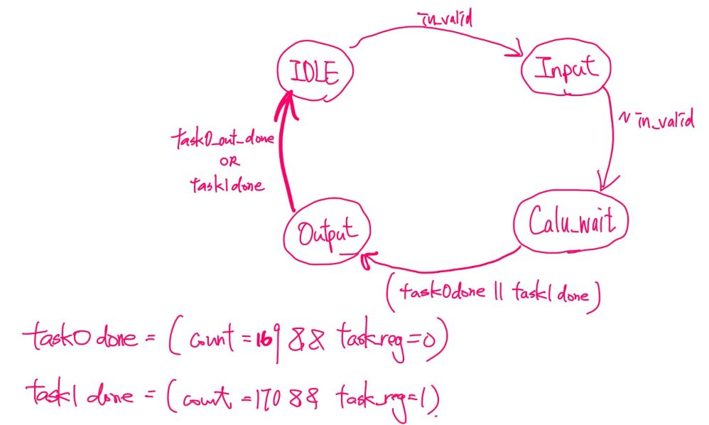

# Lab04 Convolution Neural Network
## 題目說明

### **▲  Inputs**
| 名稱             | 位元數  | 說明                                         |
| -------------------- | ------- | -------------------------------------------- |
| clk, rst_n, in_valid | 1 bit   | 時脈、重置、輸入有效訊號                     |
| Image                | 32 bits | 6x6 的image                                  |
| Kernel_ch1           | 32 bits | 3x3 的卷積核 (Channel 1)                     |
| Kernel_ch2           | 32 bits | 3x3 的卷積核 (Channel 2)                     |
| Weight_Bias          | 32 bits | 兩層 Fully Connect 的Weight以及Bias          |
| mode                 | 2 bits  | 選擇 padding 方式及Activation Function       |
| task_number          | 1 bit   | 0: 執行 CNN；1: 執行 Cost-Constrained Kernel |

### **▲ Outputs**

| 名稱  | 位元數  | 說明                                                   |
| --------- | ------- | ------------------------------------------------------ |
| out_valid | 1 bit   | 輸出有效訊號                                           |
| out       | 32 bits | task0 時輸出 CNN 的三個結果，task1 時輸出選擇的 Kernel |

  
### **▲ 主要流程**
- 主要是用一個最大的counter去安排要做的事情，這樣寫起來會很快

- 紅色長方形的部分是本身在儲存變數時就用到的register，紫色的部分是為了降低critical path而切的register，在使用Exponent IP時建議加上register避免Cycle Time過高

---
## 注意事項
- 建議在開始前就先想好每一個Cycle要做什麼事情、pipeline要怎麼切、要用多少的乘法、加法、Exponent的IP
  ，否則打到一半才要改架構會很麻煩
- 先自己使用高階程式語言，不僅可以生pattern，還更方便自己去debug是哪一個計算出現問題
---
## $Performance$ =  $Total Latency$ * $Cycle time$ * $Area^{2}$

| 1st_demo Rate | demo         | Cycle time | Area    | Total Latency |
| ------------- | ------------ | ---------- | ------- | ------------- |
| 76.8%         | **1st_demo** | 29.3       | 3059756 | 17368         |

---
## Tips
- input進來的時候直接用接線來實現padding
- 降低Latency
   - 輸入到第9個Cycle時，就可以開始做Convolution
   - 輸入到第61個Cycle時，可以開始做Max Pooling
   - 輸入花了72個Cycle，故輸入就要開始計算，否則浪費
   - 最後task0在結束input後的第100Cycle輸出完畢
- 因為performance是面積的平方，所以只開了九顆浮點乘法IP，用時間換取空間
- 建議使用Shifting來儲存，可以有效降低面積
- 因為浮點數比較器面積較小，故使用了八顆一次找到其中一個max pooling值，(共需4個cycle)
- tanh 可上下同乘$e^x$，這樣可以從兩顆Exponent化簡成一顆
- 再計算Exponent指數時可以用IEEE-754的特性，-x就是把第32個位元反向，2x就是把指數位置+1
  ```verilog
    always @(*)
        if(mode[0]==1)//swith e^-x
            case(count)
                148 : exp_power = {~ch1[0][0][31],ch1[0][0][30:0]};
                149 : exp_power = {~ch1[0][1][31],ch1[0][1][30:0]};
                .....略
            endcase
        else //tanh e^2x
            case(count)
                148 : exp_power = (ch1[0][0][30:0] == 31'b0) ?
                                    32'b0 : {ch1[0][0][31],ch1[0][0][30:23]+1'b1,ch1[0][0][22:0]};
                149 : exp_power = (ch1[0][1][30:0] == 31'b0) ?
                                    32'b0 : {ch1[0][1][31],ch1[0][1][30:23]+1'b1,ch1[0][1][22:0]};
                .....略
            endcase
  ```
- 嘗試過後發現用div的IP比較不優，可以使用DW_fp_recip(倒數) 再加上DW_fp_mult(乘法)
- 再計算Fully Connect時，可以用一個MUX與前面Convolution的乘法和加法共用IP，以節省面積
- Soft max的部分也建議使用前面使用的IP，節省面積。
- Exponent後若沒切一級的話，CycleTime大該只能壓到35ns，切了一級可以壓到27ns
- Task1 邊做Convolution時就可以邊相加算Result，最後用窮舉法把16種可能都算過一遍(16Cycle)
- Convolution本來是用 sum4 + sum4 +sum3 實現九個相加，最後發現面積不佳，改成四顆sum3
---