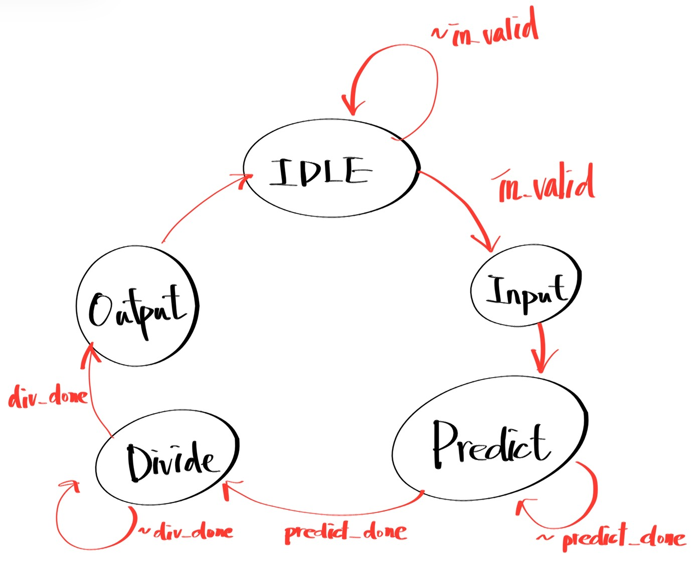

# Lab06 WinRate & Poker
## 題目說明

### **▲ Inputs**
| 名稱         | 位元數 | 說明                                 |
| ------------ | ------ | ------------------------------------ |
| clk          | 1      | 時脈信號 (Clock) 。                  |
| rst_n        | 1      | 非同步低態重置信號                   |
| in_valid     | 1      | 輸入資料有效訊號                     |
| in_hole_num  | 72     | 9 位玩家的手牌號碼，每位玩家兩張手牌 |
| in_hole_suit | 36     | 9 位玩家的手牌花色，每位玩家兩張手牌 |
| in_pub_num   | 12     | 3 張公共牌的號碼                     |
| in_pub_suit  | 6      | 3 張公共牌的花色                     |

### **▲ Output**
| 名稱         | 位元數 | 說明           |
| ------------ | ------ | -------------- |
| out_valid    | 1      | 輸出有效訊號   |
| out_win_rate | 63     | 9 位玩家的勝率 |

### **▲ 主要流程**
- WinRate (Top Module).

  

  1. 掃描所有撲克牌，過濾掉已發出的 21 張牌，將剩餘未知的 31 張牌存著，以利後續快速生成組合。
  2. 進入 PREDICT 狀態，跑31張牌的所有組合( C(31,2) = 465 )。每個 Cycle 將手牌與公牌，傳送給 Poker IP 進行判斷贏家。
  3. 接收IP回傳的贏家訊號。採用「加權分數」機制：單獨獲勝得 36 分，兩家平分各得 18 分，依此類推，確保積分精確無誤差。
  4. 利用一個共享的除法器，花費9個 Cycle 依序計算每位玩家的最終勝率
- Poker (Soft IP)

  1. 同時計算 9 位玩家的牌力。每位玩家將牌轉換為一個 24-bit 的 score，格式為 {Hand_Type(4), Major_Kicker(4), Minor_Kicker(4), Kicker1(4), Kicker2(4), Kicker3(4)}。這種格式可以直接透過數值比較來決定勝負。
  2. 將每位玩家的分數與其他所有玩家進行並行比較 (score[i] >= score[n])，同時將分數最高的玩家訊號拉成1

---
## 注意事項
- Poker.v需純組合邏輯，所以主要的Critical Path會出現在這邊
- 盡量降低IP面積，並可以多嘗試使用1顆及2顆IP的Performance
---
## $Performance$ =  $Total Latency$ * $Cycle time$ * $Area$

| 1st_demo Rate | demo         | Cycle time | Area     | Total Latency | Rank |
| ------------- | ------------ | ---------- | -------- | ------------- | ---- |
| 79.72%        | **1st_demo** | 13.0       | 461804.8 | 500000        | 54   |

---
## Tips
- 理論上檢查撲克牌(52Cycle) + 跑所有組合(465Cycle) = 517Cycle，但是當我檢查撲克牌時其實就可以開始偷算，可加速17Cycle
- 一定要在IP前後加上DFF，避免Critical Path太長導致Violation
- 我用兩顆IP確實可以讓latency降低一半(從500->250)，但是面積增加不只一倍，故最後考慮使用一顆IP
- 其實觀察一下不難發現，德州撲克不可能存在5 6 7 8人同時獲勝的可能，所以可將加權分數下降，降低除法及加法的bits數
- 在同花順、皇家同花順，只需要紀錄Hand_Type以及Major_Kicker，不需要關心後面的Kicker
---