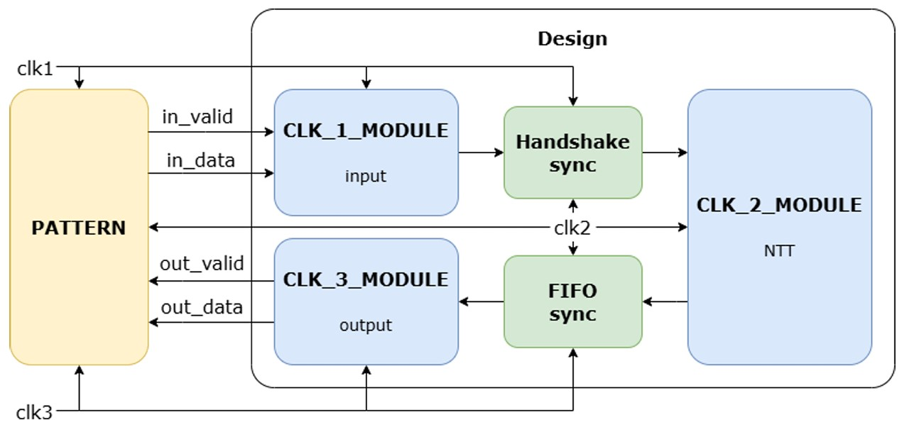
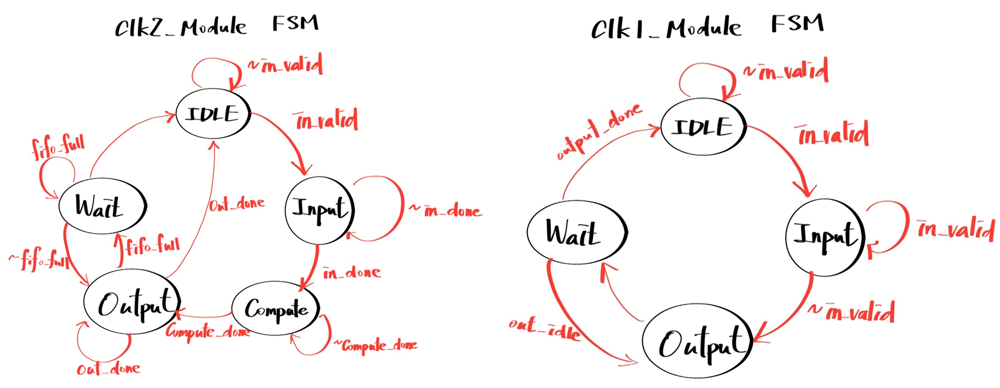
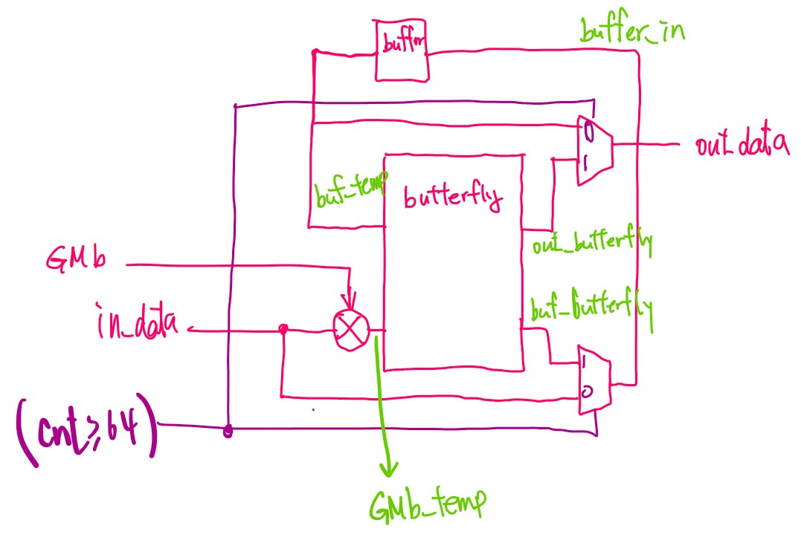
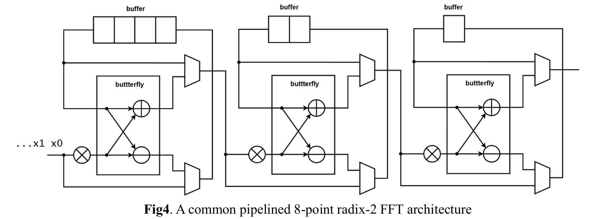

# Lab07 Number Theoretic Transform (NTT)
## 題目說明

### **▲ Inputs**
| 名稱     | 位元數 | 說明                                                     |
| -------- | ------ | -------------------------------------------------------- |
| clk1     | 1      | Clock 1 (14.1ns)                                         |
| clk2     | 1      | Clock 2 (10.1ns)                                         |
| clk3     | 1      | Clock 3 (20.7ns)                                         |
| rst_n    | 1      | 非同步低態重置信號                                       |
| in_valid | 1      | 輸入資料有效訊號 (Domain: clk1) 。                       |
| in_data  | 32     | 輸入128個係數。in_valid 會持續 16 個Cycle，每個係數4-bit |

### **▲ Output**
| 名稱         | 位元數 | 說明                           |
| ------------ | ------ | ------------------------------ |
| out_valid    | 1      | 輸出 128 個週期，不要求連續 。 |
| out_win_rate | 16     | NTT 運算結果 (Domain: clk3) 。 |

### **▲ 主要流程**

| 名稱                   | 說明                                              |
| ---------------------- | ------------------------------------------------- |
| CLK_1_MODULE           | 負責接收 32-bit 的輸入多項式係數                  |
| Handshake Synchronizer | 將資料從 clk1 傳到 clk2                           |
| CLK_2_MODULE           | 核心運算，在clk2內完成 128點 NTT 運算             |
| FIFO Synchronizer      | 用Dual Port SRAM實現的非同步 FIFO，連接clk2與clk3 |
| CLK_3_MODULE           | 從 FIFO 讀取運算結果並輸出 16-bit 資料            |

- NTT的部分先設計好每一級的module，128個點NTT總共有7級，圖一為每級NTT架構，圖二為三級NTT的示範

  

  

---
## 注意事項
- CDC是本lab的重點。Handshake 和 FIFO 必須正確實作，且設計**必須**通過 Jasper Gold 驗證
- 有些人JG會跑很久，所以建議早一點開始實作
- SRAM: 必須使用 TA 提供的來實作 FIFO
- RTL 模擬時 clk3 會有四種不同週期，設計必須都能正常工作
---

| 1st_demo Rate | demo    (70%) | Area     | Total Latency | Jasper Gold(25%) |
| ------------- | ------------- | -------- | ------------- | ---------------- |
| 83.21%        | **1st_demo**  | 942939.3 | 1876002       | PASS             |

---
## Tips
- 因為本次Lab的Performance只有5%，所以做完我就沒優化，先去做期末了> < 所以Tips就稍微參考就好
- 我身邊通常JG沒過的同學都是Convergence問題，而實際上面顯示的錯誤warning根本不准，所以要熟悉Handshake 和 FIFO 的電路，我原本在current_state也遇到Convergence，但實際上我將busy在適當的時間關閉，以及將FIFO的Full邏輯改成Sequential後就過了，與current_state一點關係也沒有.....
- 每一級的NTT後面都要加一級DFF，避免Violation
- 建議將每一個時間點要做什麼事情都做成Excel，會更方便設計
- 因為clk3可能會很慢，所以SRAM可能會滿，而剛好題目要求不連續，所以當SRAM滿的時候就NTT那一級就要停止傳輸，等到有空間再繼續傳輸
- clk3也可能會很快，導致SRAM一直都是空，這個時候沒有值可以輸出，output需要暫停。
---