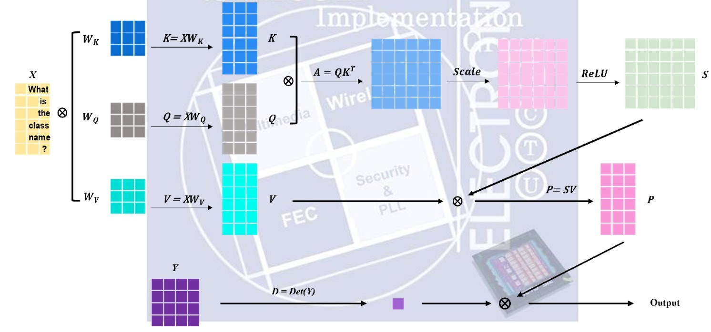

# Lab08 Self-Attention with Determinant
## 題目說明

### **▲ Inputs**
| 名稱          | 位元數 | 說明                                       |
| ------------- | ------ | ------------------------------------------ |
| clk           | 1      | 50ns固定時脈                               |
| rst_n         | 1      | 非同步低態有效重置信號                     |
| cg_en         | 1      | 高電位時開啟Clock Gating                   |
| in_valid      | 1      | 輸入資料有效訊號。                         |
| in_data1      | 6      | 4x4 矩陣 Y 的數值，共 16 Cycles            |
| T             | 4      | 輸入長度，T 可能為 1, 4, 8                 |
| in_data2      | 8      | 輸入矩陣 X 的數值，共 T×8 Cycle            |
| w_Q, w_K, w_V | 8      | 權重矩陣 WQ​,WK​,WV​ 的數值，各有 64 Cycle |

### **▲Output**
| 名稱      | 位元數 | 說明               |
| --------- | ------ | ------------------ |
| out_valid | 1      | 輸出有效訊         |
| out_value | 92     | Self-Attention結果 |

### **▲ 主要流程**
<!--  -->
<div style="text-align: center;">
  
</div>

- Q/K/V Matrix : 因輸入為依序給$K$-> $Q$ -> $V$，故共用同一組MAC來依序計算 $Q=XW_Q$、 $K=XW_K$ 與 $V=XW_V$。透過 calu_Q, calu_K, calu_V 等訊號切換 MAC 的輸入來源
- Attention Score : 在輸入V時，因為已有K以及Q，所以多開八顆乘法，用64cycle將Attention算出來
- Hidden States : 最後使用MAC計算 $P = SV$
- Determinant Calculation : 用降階法將 4x4 行列式分解為 4 個 3x3 行列式進行計算
- Output : 將 Self-Attention 的結果 $P$ 與行列式值 $Det\_y$ 相乘，並依據 $T$ 的長度依序輸出
---
## 注意事項
- 功耗要求: cg_en 開啟前後的總功耗必須減少至少 **20%** 才能通過驗證
- 前十個繳交有5分加分
- JG的02過了有5分加分
- 本次Performance沒有面積

---
## $Performance$ =  $Total Latency$ * $Power^{2}$

| Rank   | Score      | 1st_demo Rate | demo     | Bonus:(JG 02)(+5) | Bonus:前十名繳交(+5) |
| ------ | ---------- | ------------- | -------- | ----------------- | -------------------- |
| **24** | **106.38** | 81.81%        | 1st_demo | **PASS**          | **PASS**             |

| Power(clock gating) | Power(w/o clock gating) | Save Power Rate | Latency |
| ------------------- | ----------------------- | --------------- | ------- |
| 0.0214 W            | 0.0109 W                | **49.1%**       | 1       |

---
## Tips
- $Q, K, V$ 的輸入與計算在時間上是錯開的，透過 MUX 在不同時間點共用矩陣乘法，有效減小面積
- JG的01要過，必須是w/o clock gating以及clock gating的演算法一致，才能通過
- 建議先在w/o clock gating先做好一切優化，之後加上clock gating，才不會兩邊都要改
- JG的02要過，設計上必須formal-friendly，其實蠻抽象的，但是只要coding style好，不要用太複雜的邏輯，好像都過得了。
- 因為不考慮面積，所以能偷算就偷算，把latency降到最低，我直接降到input完直接output
- 因為前十個交的有+5分，所以禮拜四下午作完就交了，但是後面優化完，可以將power降至更低
- 省power不僅有clock gating，還有data gating，當我有一些變數沒有要用到的時候，我會將他拉成0，以此降低power
- 建議把所有的Matrix都加上Clock Gating，且因為會有fan-out問題，所以要把每一個元素都用不同的clk去做驅動，很多同學因為這樣導致clk在03出現Unknown，舉例:
```verilog
generate
  for (gen_i = 0; gen_i < 8; gen_i = gen_i + 1) 
    for (gen_j = 0; gen_j < 8; gen_j = gen_j + 1) 
      GATED_OR GATED_K (.CLOCK(clk), .SLEEP_CTRL(cg_en & K_sleep),.RST_N(rst_n), .CLOCK_GATED(clk_K[gen_i][gen_j]));
      always @(posedge clk_K[gen_i][gen_j] or negedge rst_n) 
        if(!rst_n)  K[gen_i][gen_j] <= 19'd0;
        else if(calu_K && (calu_K_index == gen_j)) K[gen_i][gen_j] <= KQV_temp[gen_i];
endgenerate
```

---

