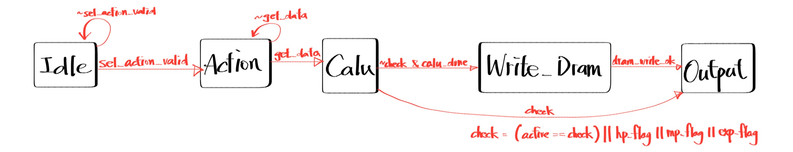
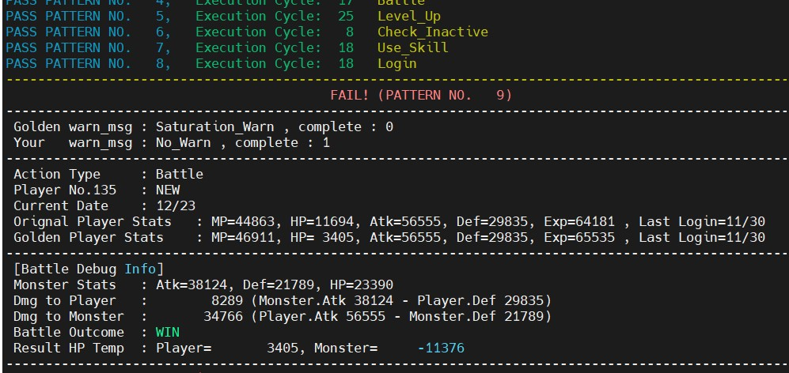

# Lab09 Role-Playing Game (RPG)
## 題目說明

### **▲ Inputs**
## Inputs

| 名稱             | 位元數 | 說明                                                                 |
| ---------------- | ------ | -------------------------------------------------------------------- |
| clk              | 1      | System Clock                                                         |
| rst_n            | 1      | 非同步低態有效重置信號                                               |
| valid            | 1      | sel_action_valid, type_valid,mode_valid, date_valid, player_no_valid |
| monster_valid    | 1      | Monster 有效訊號  (3個cycle)                                         |
| MP_valid         | 1      | Skill MP 有效訊號 (4個cycle)                                         |
| D                | 144    | "包含 Action, Type, Mode, Date, ID, Attribute 等數據的 Bus"          |
| AXI4-Lite Inputs | -      | "AR_READY, R_VALID, R_DATA, AW_READY, W_READY, B_VALID, B_RESP"      |

## Outputs

| 名稱              | 位元數 | 說明                                                                      |
| ----------------- | ------ | ------------------------------------------------------------------------- |
| out_valid         | 1      | 輸出有效訊號 (1 cycle)                                                    |
| warn_msg          | 3      | 警告訊息 (No_Warn, Date_Warn, Exp_Warn...)                                |
| complete          | 1      | 若沒有警告訊息則拉1，若有緊告則拉0                                        |
| AXI4-Lite Outputs | -      | "AR_VALID, AR_ADDR, R_READY, AW_VALID, AW_ADDR, W_VALID, W_DATA, B_READY" |


### **▲ 主要流程**

<!-- <div style="text-align: center;">
  
</div> -->

- AXI4-Lite Bridge : 使用一個Read Dram以及Write DRAM去與 DRAM 溝通。且DRAM 的 Latency 是浮動的，所以需要FSM去控制。
- Data Unpacking : DRAM 資料排列方式為 {HP, M, D}, {Atk, Def}, {Exp, MP}，將其轉換為Player_Info的struct會更方便計算，也是System Verilog的一大優點。
- Action FSM
    - Login : 判斷日期是否連續 (需考慮跨月、跨年)，給予 Exp/MP 獎勵
    - Level Up : 若Exp足夠，則依據 Type 與 Mode 計算 $\Delta_{final}$，並更新屬性。
    - Battle : 檢查初始 HP 是否為 0 ，並計算對 Player 與 Monster 的傷害，判斷 Win/Loss/Tie。
    - Use Skill : 實作演算法找出「數量最多」且「消耗最少」的技能組合。
    - Check Inactive : 計算距離上次登入是否超過 90 天。
---
## $Performance$ =  $Latency$ * $Cycle Time$ * $Area$

| Rank   | 1st_demo Rate | demo     | Cycle time | Area     | Total Latency |
| ------ | ------------- | -------- | ---------- | -------- | ------------- |
| **19** | 78.83%        | 1st_demo | 3.3        | 144268.9 | 1246089       |

---
## Tips
- 因為demo時候，DRAM的latency在1到100之間，平均50，所以在各個計算當中都切入一級Register，包括Sorting、加法、計算日期等等......，降低Critical Path，是最有效的優化方式。(Cycle = 6.2 -> 3.3)
- 因助教給的pseudo_DRAM是加密的，所以在debug時會較困難，建議自己寫一個pseudo_DRAM來模擬DRAM，可以更好的觀察波形。
- **強烈**建議把不需要寫進DRAM的行為給特別避開，因為寫入DRAM是最耗latency的地方，例如玩家資訊沒更動、或者是Check的Action，就不需要寫入DRAM。
- 用counter == 1 或 counter==2 去做某些行為，會合成出比較器，面積較大，所以建議直接把Counter經過兩層DFF來去做判斷，可以降低面積(Area: 150880 -> 144268)
- 能共用硬體就共用，不同的cycle用多工器去選現在要做什麼，可以省下很多Area
- 建議用typedef來讓自己的波形更好觀察，也可以讓你的程式更有可讀性，如下
  ```systemverilog
    typedef enum logic [1:0] { WIN = 'd0, LOSS= 'd1,TIE = 'd2 } battle_result;
  ```
- Lab10就要寫pattern了，所以我先寫一個好debug的Pattern，把錯誤的action重要資訊都列出來，不僅可以造福同學們，還可以增進自己pattern的能力!


---

