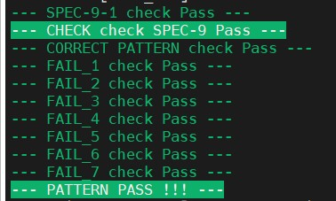

# Lab10 Verification : Role-Playing Game (RPG)
## 題目說明

### **▲ 主要流程**
- PATTERN (Stimulus Generation) :
  - Golden Model : 完整的 RPG 邏輯，用以預測正確的 warn_msg, complete 以及 DRAM 內的數值。

- CHECKER (Coverage & Assertion) :
  - Coverage : 定義 covergroup 來收集功能覆蓋率
  - Assertion : 使用 SVA (SystemVerilog Assertion)檢查時序違規，例如 out_valid 只能為 High 一個 cycle、Input Valid 不重疊等。

#### Assertions

| 項目        | 檢查內容                                                                   |
| ----------- | -------------------------------------------------------------------------- |
| Assertion 1 | Reset 後，所有輸出訊號都必須為 0                                           |
| Assertion 2 | Latency 必須小於 1000 cycles                                               |
| Assertion 3 | 如果complete=1，Warn_Msg 必須為 0 (No_Warn)                                |
| Assertion 4 | 下一個 input valid 訊號必須在前一個 input valid 拉低後的 1-4 cycles 內拉高 |
| Assertion 5 | 所有的 input valid 訊號彼此之間不能Overlap                                 |
| Assertion 6 | out_valid 只能維持1 個 cycle High                                          |
| Assertion 7 | 下一個操作必須在 out_valid 拉低後的 1-4 cycles 內開始。                    |
| Assertion 8 | 輸入的日期必須符合真實日曆規則 (例如：不能有 2/29, 4/31, 13/1 等)。        |
| Assertion 9 | AR_VALID 訊號不能與 AW_VALID 訊號重疊。                                    |
#### Coverage
| 項目   | 要求                                                                          |
| ------ | ----------------------------------------------------------------------------- |
| SPEC 1 | Training_Type 的每種情況至少被選擇 **200** 次。                               |
| SPEC 2 | Mode 的每種情況至少被選擇 **200** 次。                                        |
| SPEC 3 | SPEC 1 與 SPEC 2 的Cross bin每種至少被選擇 **200** 次。                       |
| SPEC 4 | player_no (0~255) 的每個 bin 至少被命中 **2** 次。                            |
| SPEC 5 | Action 從 [Login:Check_Inactive] 到 [Login:Check_Inactive]，每種至少 200 次。 |
| SPEC 6 | """Use Skill"" 動作中消耗的 MP 數值，每個 bin(bin_max=32)至少命中 1 次。      |
| SPEC 7 | Warn_Msg 的每種輸出至少出現 20 次。                                           |
---
## 注意事項
- Coverage一定要完全打到才會在detail中顯示，我身邊很多人都卡在這裡，例如你的bins要打到200次，但你只有打到199次，detail就不會顯示
- 可以跟其他人比較CoverGroup數量，避免漏測
- 與其他人交換Pattern時候記得加密

---
## $Performance$ =  $Simulation$ $Time$

| Rank   | 1st_demo Rate | demo     | Simulation Time | Coverage |
| ------ | ------------- | -------- | --------------- | -------- |
| **39** | 79.56%        | 1st_demo | 1461414ns       | 100%     |

---
## Tips
- Directed Random: 為了**快速**達到 100% Coverage，純 Random 需要約20000筆資料。所以可以計算最複雜的並直接給值
  - [Login:Check_Inactive] 到 [Login:Check_Inactive]跑200次 ( 5X5X200 = 5000筆資料)
  - 其中5000筆中有1000筆的Level Up
  - Training_Type Cross Mode 各200次 ( 4X3X200 = 2400筆資料)
  - 所以總共最少需要5000  - 1000 + 2400= 6400筆資料，就可以達到100% Coverage
- 建議劃出波型圖，並標示出每個Assertion，更方便撰寫Checker
- 可以使用自己的checker以及Pattern回去檢查Lab9的設計是否正確
- 可以自己寫一個測試的腳本，就不用每一次都打指令跑模擬

---

