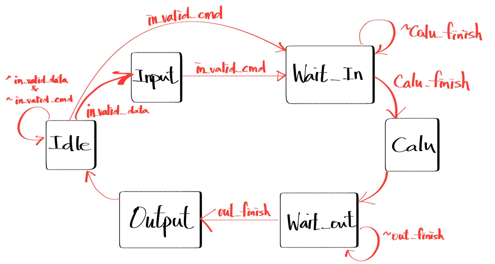
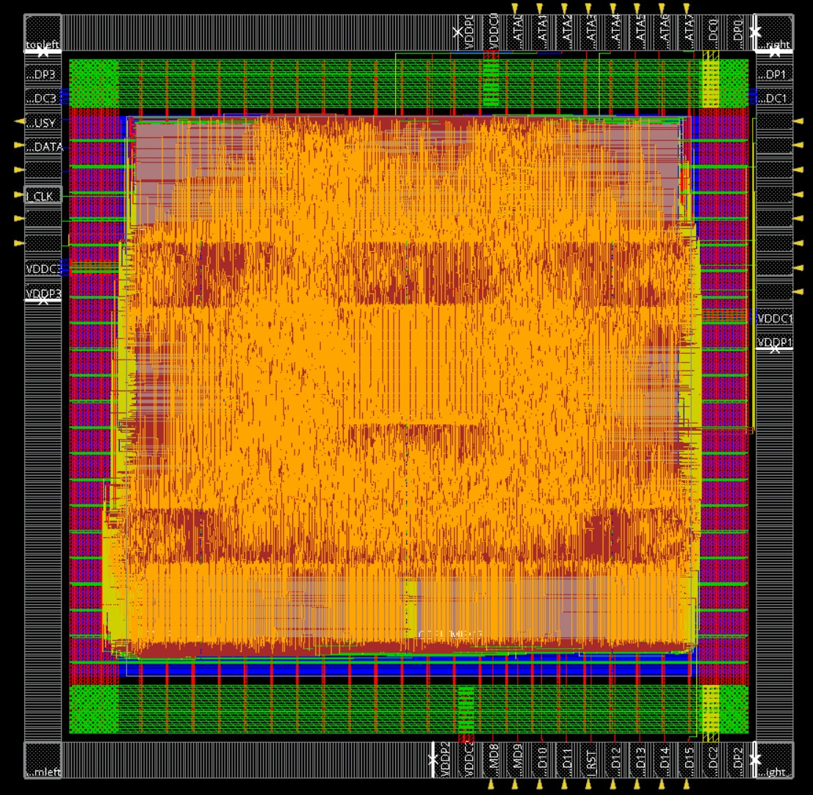

# Lab11 Geometric Transform Engine
## 題目說明

### **▲ 主要流程**

  

- Data Loading:
  pattern一開始依序傳送128 張 16x16 的影像 
  根據不同的照片，將資料存入不同的 SRAM 中
  - Image 0~63: 存入 MEM0~MEM3 (4096x8)
  - Image 64~95: 存入 MEM4~MEM5 (2048x16)
  - Image 96~127: 存入 MEM6~MEM7 (1024x32)
  
- Command Decoding:
  - op, func (4 bits): 決定 15 種幾何變換操作 (Mirror, Transpose, Rotate, Shift, Reorder) 
  - ms (7 bits): 第幾張照片為來源
  - md (7 bits): 第幾張照片為目的

- Execution (GTE Core):
  - Read : 根據 ms 從對應的 SRAM 讀取 16x16 圖片 。
  - Calculation: 實作了 Mirror (X/Y), Transpose (Main/Sec), Rotation (90/180/270), Shift (R/L/U/D with Mirror Padding), Reorder (Zig-zag, Morton) 等操作 。
  - Write: 將變換後的結果寫回 md 指定的 SRAM。

- Output Control:
存入SRAM完成後，將 busy 拉低一個 Cycle，讓 Pattern 檢查 SRAM 中的結果

## 注意事項
- 建議一天半內完成Pattern以及Design，留下後面的時間去做APR。(因APR中間的routing以及ECO等待時間較久)
- Core Utilization 一開始可以設定0.6~0.7，成功之後再拉高。否則後面DRC可能會不好過
- 做完每一個步驟都要存檔。
- 建議合一個Cycle Time比較大的去做APR。

---
## $Performance$ =  $Chip Area$ * $Latency$ * $Cycle Time$

| 1st_demo Rate | demo         | Cycle time | Chip Area   | Total Latency |
| ------------- | ------------ | ---------- | ----------- | ------------- |
| 74.82%        | **1st_demo** | 11.6       | 8616757.867 | 456960        |

---
## Design Tips
- 因為SPEC中只有提供8X8的Transform，所以我用python生了各種計算的16X16圖形，方便我設計design中的MUX。
- Pattern打得越好，越方便自己Debug
## APR Tips
- 建議自己跑過一次GUI的步驟後，將commend存下來，方便後續優化直接重跑，而不需要手動GUI點。[>點這裡<](./cmd/)
- 算好自己Design花的Power，就用多少的PAD，太多反而會把面積撐大。
- Floorplan的時候，盡量把SRAM都擺在邊邊。
- 我的Design 可以將Cycle Time壓到4.8ns，但最後選擇拿6ns去合成，這樣可以讓APR有更多空間。
- NanoRoute結束後，若DRC有800以上的violation，建議直接設低一點的Utilization重新APR，不要浪費時間了!(我ECO了30幾次還是過不了DRC > <
- 最後繳交前一定要確定DRC、DRV、LVS、setup、hold time有沒有過，最後可以用summaryReport -noHtml來查看自己APR後的詳細內容(包含面積等等資訊)

  

---

