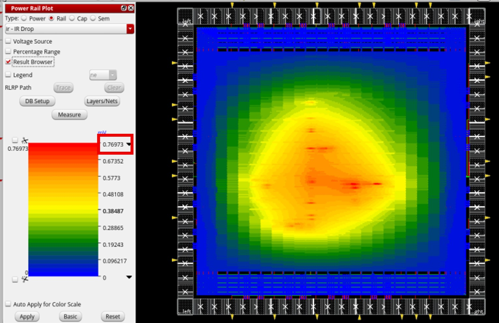

# Lab12 IR Drop
## 題目說明
- 助教會給已經合成好的design，我們只需要APR並做Power Analysis 以及 Rail Analysis即可。

---
## APR Tips
- 若想要讓最後的IR drop低一點，建議：
  - 1.PAD盡量分散，而不要全部集中在一個區域
  - 2.讓整個chip是正方形的
  - 3.將Core Power PAD 平均分散在每一個邊
  - 4.增加Stripes的數量
- 雖然題目要求100mV以下就可以通過這次Lab，但是建議同學們可以試試看更低的IR drop，像我就成功壓到0.77mV以下，可以讓你更了解如何降低IR drop。

  

---

