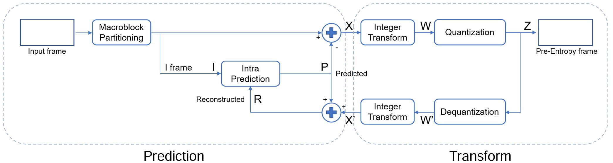

# Lab05 H.264 Lite Prediction and Transform Engine
## 題目說明

### **▲ Inputs**
| 名稱           | 位元數 | 說明                                        |
| -------------- | ------ | ------------------------------------------- |
| clk            | 1      | 時脈                                        |
| rst_n          | 1      | 非同步重置信號                              |
| in_valid_data  | 1      | 資料有效訊號                                |
| in_valid_param | 1      | 參數有效訊號                                |
| data           | 8      | 輸入一張32X32的照片，持續16張(16384個Cycle) |
| index          | 4      | 目前要處理哪一張照片                        |
| mode           | 32     | Intra Prediction選擇，0:16X16，1:4X4        |
| QP             | 5      | 控制壓縮率及品質的參數                      |

### **▲Output**
| 名稱      | 位元數 | 說明                                                                 |
| --------- | ------ | -------------------------------------------------------------------- |
| out_valid | 1      | 輸出有效訊號                                                         |
| out_value | 32     | H.264量化後的pre-entropy frame (每張照片輸出1024個Cycle，共16張照片) |

### **▲ 主要流程**

- Prediction:
  - 把16384個Frame存在32X32X16的SRAM裡面，之後等待parameter(QP mode index)，並根據index從SRAM中取出該張照片，再依據mode來判斷現在要做16X16的prediction還是4X4的prediction
  - 4X4時，等待16cycle輸入，並將SAD算出，來判斷prediction應該要拿dc、vertical還是horizontal，16X16時則是等待256cycle。
- Transform 
  - 不論16X16還是4X4都將其分成4X4來處理，integer transform後進行Quantization並output，在output的同時我會做DeQuantization以及Inverse Transform來還原圖片，並存進的我的Edge，等待下一次的prediction使用。
<!--  -->

---
## 注意事項
- 開始前就先想好要開多少的SRAM、register、counter以及FSM要怎麼設計，因為本次使用到的變數較多，也可以用EXCEL先記錄起來，如下圖
<!-- -  -->
- SAD即使算錯，因為最終只是比較SAD大小而已，所以可能會因此打中很多case，所以測試時務必使用多一點的pattern來測試
- 將SRAM設定成接近正方形，可避免總體等效電容過大，而未來在APR時可以避免空間浪費
- 先計算中間的transform、quantization、dequantization、inverse transform所需要的bits數，避免overflow
- SRAM前後都建議加上一級register，避免Cycle Time過高。
- SRAM需要等待一個Cycle後才會把值接出來，若是用counter控制的話，可以用一層DFF來將counter延遲一個cycle
- Inverse Integer Transform: 因為算出來可能為負數，因此將>>改成>>>以避免出現負變正的情況出現
---
## $Performance$ =  $Total Latency$ * $Cycle time$ * $Area^{2}$

| 1st_demo Rate | demo         | Cycle time | Area    | Total Latency |
| ------------- | ------------ | ---------- | ------- | ------------- |
| %             | **1st_demo** | 13.0       | 2361697 | 5357703       |

---
## Tips
- transform的部分其實是Hadamard matrix，所以可以單純用加法就將矩陣實現，不需要乘法
- 因一張照片被分成四等，嘗試過開四顆SRAM，會相對比較好控制，但是SRAM本身+多個MUX去選擇SRAM，所以面積較大，故最後選擇開一顆SRAM
- 盡量在輸出或輸入時也有其他動作，而不是閒置，浪費latency，例如在從SRAM取值時，就可以算SAD，以及在output時就可以做inverse transform、dequantization
- 大多人FSM使用16X16一個支路，4X4一個支路，但其實除了SAD、vertical以及horizontal的計算方式不同外，其他部分都是一樣的，所以可以將16X16以及4X4的部分合併，這樣可以減少FSM的狀態數量

---