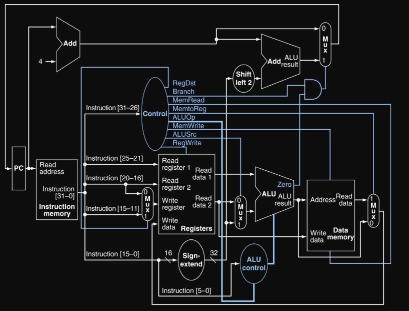
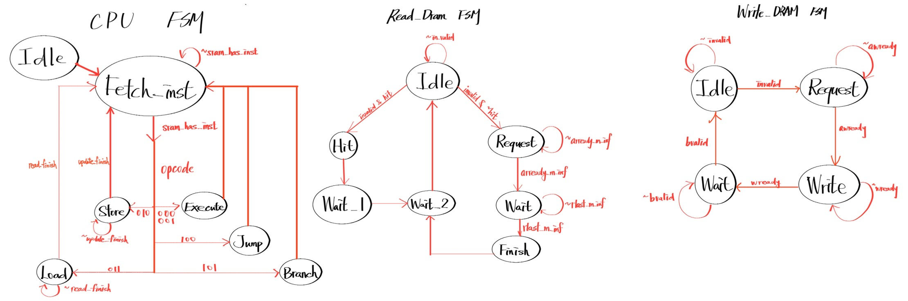

# MidTerm Central Processing Unit (CPU)
## 題目說明

### **▲ 主要流程**
- 此CPU採Multi-Cycle，而非標準的pipeline CPU。因為發現DRAM的讀取速度非常慢(100~1000Cycle)，所以降低MissRate才是首要任務，使用Multi-Cycle不僅可以不考慮Hazard，還可以更簡單的降低MissRate問題。

  

---
## $Performance$ =  $Total Latency^{2}$ * $Area$

| 1st_demo Rate | demo         | Cycle time | Area   | Total Latency | Rank |
| ------------- | ------------ | ---------- | ------ | ------------- | ---- |
| 76.64%        | **1st_demo** | 3.9        | 157031 | 31278         | 59   |

---
## Tips
- SRAM 設計:
  使用 256-word (512-byte) 的SRAM，前128word當作I-Cache，後128word當作D-Cache。並將AXI控制的電路寫成Write以及Read兩個module。
- Read DRAM 設計:
  [13:8] 位元做為Tag，[7:1] 位元做為SRAM的address，如果Tag一樣，則FSM進入到HIT的State，無須再從DRAM中取值，反之則進入Request的State，並等待128Cycle，從DRAM把值存進SRAM。
- Write DRAM 設計:
  每當我執行到Store指令時候我便會進入Request的State，等待DRAM確實寫入後，還要更新SRAM內的資料。
- AXI 控制:
  DRAM仍是外部訊號，故input以及output都需要加上一級Register，避免吃到External Delay

---

