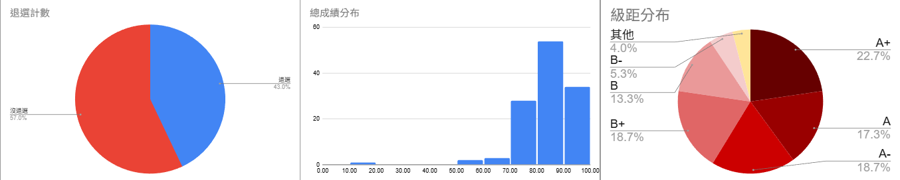

# NYCU_ICLAB_2025_FALL
僅供參考，請不要抄襲，助教會拿考古抓!
- 課程名稱 : 積體電路設計實驗 Integrated Circuit Design Laboratory (ICLAB)
- 修課學期 : 2025 FALL
- 學期初修課人數 : 
- 退選人數 : 
- 全班平均 : 
---

## Demo Result
- Total Score : 90.089
- Total Rank : **33**

| Lab                      | Demo    | Rank   | Score      | 1de        | Name                                       |
| ------------------------ | ------- | ------ | ---------- | ---------- | ------------------------------------------ |
| [Lab01](./Lab01/)        | 1st     | **10** | 97.89      | 72.72%     | Multi-Packet Channel Arbiter               |
| [Lab02](./Lab02/)        | 1st     | **26** | 93.9       | 83.67%     | SUDOKU                                     |
| [Lab03](./Lab03/)        | **1st** | 103    | 82.42      | **48.97%** | Convex Hull                                |
| [Lab04](./Lab04/)        | 1st     | 95     | 77.97      | 76.87%     | Convolution Neural Network (CNN)           |
| [Lab05](./Lab05/)        | 1st     | 76     | 80.6       | 50.34%     | H.264 Lite Prediction and Transform Engine |
| [Lab06](./Lab06/)        | 1st     | 54     | 87.48      | 79.72%     | WinRate & Poker                            |
| [Lab07](./Lab07/)        | 1st     | 99     | 96.11      | 83.21%     | Number Theoretic Transform (NTT)           |
| [Lab08](./Lab08/)        | 1st     | **24** | **106.38** | 81.81%     | Self-Attention with Determinant            |
| [Lab09](./Lab09/)        | 1st     | **19** | 95.54      | 78.83%     | Role-Playing Game (RPG)                    |
| [Lab10](./Lab10/)        | 1st     | 39     | 96.81      | 79.56%     | Verification: From Lab09                   |
| [Lab11](./Lab11/)        | 1st     | 84     | 79.08      | 74.82%     | Geometric Transform Engine                 |
| [Lab12](./Lab12/)        | 1st     | -      | 100        | -          | IR drop & Power Analysis                   |
| [Lab13](./Lab13/)        | 1st     | -      | 100        | -          | Formal Verification                        |
| [MP](./Midterm_Project/) | 1st     | 59     | 90.49      | 76.64%     | MidTerm Central Processing Unit (CPU)      |
| [FP](./Final_Project/)   | 1st     | **5**  | **99.01**  | 84.61%     | Motion Vector Difference Matching          |
| ME                       | -       | -      | 86         |            |
| FE                       | -       | -      | 73         |            |

---
## 心得感想

課程中其實還有非常多厲害的人，我只是先來拋磚引玉～
相信會點進來看這篇的，應該都知道交大電子這門非常有名的課——**ICLAB**。

這一屆的助教群真的非常用心，不論是上課內容還是題目設計，都讓我在這學期中學到非常多 (難度太難，群組哀號一片)。
前五個 LAB 大概是整門課中偏硬的部分，需要不斷讓大腦跑跑跑，思考如何將演算法一步步轉化為**硬體電路**。

也非常建議大家不要一拿到題目就急著動工，而是先花時間好好思考整體架構與可能的優化方向。
回頭看前幾個 LAB，因為一開始太快進入實作，導致後續在優化時往往需要整個架構打掉重來，甚至會沒時間優化。

最後也很幸運地在這學期中，每一個Lab都順利完成 1 demo，感謝一起修課的朋友們互相交換Pattern、相互驗證，我自己的Pattern也有放在各資料夾的Code/Pattern中，歡迎各位閱讀~

希望這篇心得能給未來的修(休)課(克)同學們一些幫助囉(○｀ 3′○)！

## 助教整理之統計
